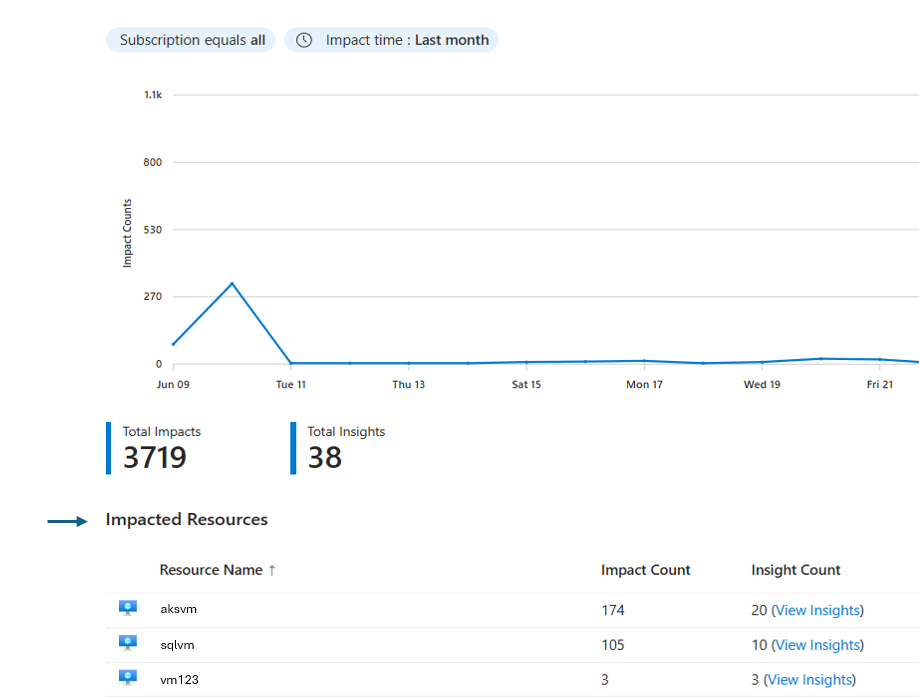

# Viewing Impact Reports and Insights (Preview)
> [!IMPORTANT]
> Azure Impact Reporting is currently in PREVIEW. See the [Supplemental Terms of Use for Microsoft Azure Previews](https://azure.microsoft.com/support/legal/preview-supplemental-terms/) for legal terms that apply to Azure features that are in beta, preview, or otherwise not yet released into general availability.
 
## Permissions needed
You need either the "**Impact Reporter**" role or `read` action on `Microsoft.Impact/WorkloadImpact/*` at the right scope (root, subscription, or resource group).

The following channels can be used to view Impact Reports and/or insights: 
1. REST API
2. Query ARG 
3. Azure portal 


#### [REST API](#tab/restapi/)
##### View Impacts using REST API: 
You can use the Impact Reporting REST API to view previously filed impact reports.
Review the full [REST API reference](https://aka.ms/ImpactRP/APIDocs).

##### View a single Impact Report

[REST API reference](https://aka.ms/ImpactRP/APIDocs)

```rest
az rest --method GET --url "https://management.azure.com/subscriptions/<Subscription_id>/providers/Microsoft.Impact/workloadImpacts/<impact_name>?api-version=2022-11-01-preview" 
```

##### Response

```json
{
  "id": "/subscriptions/<Subscription_id>/providers/Microsoft.Impact/workloadImpacts/Impact02",
  "name": "Impact02",
  "type": "microsoft.impact/workloadimpacts",
  "systemData": {
    ...
  },
  "properties": {
    "impactedResourceId": "/subscriptions/<Subscription_id>/resourceGroups/<rg-name>/providers/Microsoft.Compute/virtualMachines/<vm-name>",
    "startDateTime": "2022-11-14T05:59:46.6517821Z",
    "endDateTime": null,
    "impactDescription": "something's not right",
    "impactCategory": "Resource.Performance",
    "workload": {
      "context": "myCompany/scenario1",
      "toolset": "REST"
    },
    "provisioningState": "Succeeded",
    "impactUniqueId": "1234n98-8dc8-4c52-8ce2-6fa86e6rs",
    "reportedTimeUtc": "2022-11-14T20:55:38.7667873Z"
  }
}
```

#### [ARG](#tab/arg/)
To run these queries, go to the Azure portal [ARG query blade](https://portal.azure.com/#view/HubsExtension/ArgQueryBlade)

##### Get all Impact reports that have Insights

> This query retrieves all Impact reports with Insights, displaying key details such as the resource ID and impact properties.

```kql
impactreportresources 
|where ['type'] =~ 'microsoft.impact/workloadimpacts'
|extend startDateTime=todatetime(properties["startDateTime"])
|extend impactedResourceId=tolower(properties["impactedResourceId"])
|join kind=inner hint.strategy=shuffle (impactreportresources
|where ['type'] =~ 'microsoft.impact/workloadimpacts/insights'
|extend insightCategory=tostring(properties['category'])
|extend eventId=tostring(properties['eventId'])
|project impactId=tostring(properties["impact"]["impactId"]), insightProperties=properties, insightId=id) on $left.id == $right.impactId
|project impactedResourceId, impactId, insightId, insightProperties, impactProperties=properties
```

##### For a resource URI, Find all reported Impacts and Insights

> Given a resource Id, this query retrieves Impact reports and Insights that include the specified resource Id.

```kql
impactreportresources 
|where ['type'] =~ 'microsoft.impact/workloadimpacts'
|extend startDateTime=todatetime(properties["startDateTime"])
|extend impactedResourceId=tolower(properties["impactedResourceId"])
|where impactedResourceId =~ '<***resource_uri***>'
|join kind=leftouter  hint.strategy=shuffle (impactreportresources
|where ['type'] =~ 'microsoft.impact/workloadimpacts/insights'
|extend insightCategory=tostring(properties['category'])
|extend eventId=tostring(properties['eventId'])
|project impactId=tostring(properties["impact"]["impactId"]), insightProperties=properties, insightId=id) on $left.id == $right.impactId
|project impactedResourceId, impactId=id, insightId, insightProperties, impactProperties=properties
|order by insightId desc
```

#### [Portal](#tab/portal/)
1. Go to the Azure Impact Reporting Portal. Look for your subscription and select the date range. 
     
2. To view the insights generated from the impacts, navigate to the bottom of the page. The tabular view shows the count of the insights for each of the resource name. 
    
3. Select the insight count to see recommended actions for each of the insights

---

## Next steps
* [What is an Impact Reporting Connector for Azure Monitor Alerts?](azure-monitor-connector.md)
* [Impact Reporting Connectors - Troubleshooting Guide](connectors-troubleshooting-guide.md)
* [Get allowed Impact category list](view-impact-categories.md)