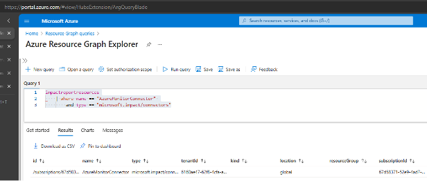

# Azure Impact Reporting Connectors for Azure Monitor FAQ (Preview)
> [!IMPORTANT]
> Azure Impact Reporting is currently in PREVIEW. See the [Supplemental Terms of Use for Microsoft Azure Previews](https://azure.microsoft.com/support/legal/preview-supplemental-terms/) for legal terms that apply to Azure features that are in beta, preview, or otherwise not yet released into general availability.

## How do I enable debug mode?

* **Bash**: Uncomment the `set -x` at the beginning of the script to enable debug mode.
* **Powershell**: Change `Set-PSDebug -Trace 0 to Set-PSDebug -Trace 1` at the beginning of the script to enable debug mode

## What should I do if I encounter a permission error?

Verify your Azure role and permissions. You may need the help of your Azure administrator to grant you the necessary permissions or roles as defined in the permissions section.

## How can I verify if the connector is successfully created?
### Option 1
* **Bash**:
    * Step 1: Run the below command: 
`az rest --method get --url https://management.azure.com/subscriptions/<subscription-id>/providers/Microsoft.Impact/connectors?api-version=2024-05-01-preview`
    * Step 2: You should see a resource with the name `AzureMonitorConnector`
* **Powershell**:
    * Step 1: Run the below command: 
`(Invoke-AzRestMethod -Method Get -Path subscriptions/<Subscription Id>/providers/Microsoft.Impact/connectors?api-version=2024-05-01-preview).Content`
`* Step 2: You should see a resource with the name `AzureMonitorConnector`

### Option 2
* Step 1: From the Azure Portal, navigate to [Azure Resource Graph Explorer](https://portal.azure.com/#view/HubsExtension/ArgQueryBlade)
* Step 2: Run the below query: 
```kql
impactreportresources  | where name == "AzureMonitorConnector"  and type == "microsoft.impact/connectors"
```
* Step 3: The results should look like below, with a row for the connector resource

    

## Next steps

- [File an impact report](ReportVMImpact.md)
<!-- Add Impact Connectors TSG -->
<!-- - [File an impact report](ReportVMImpact.md) -->